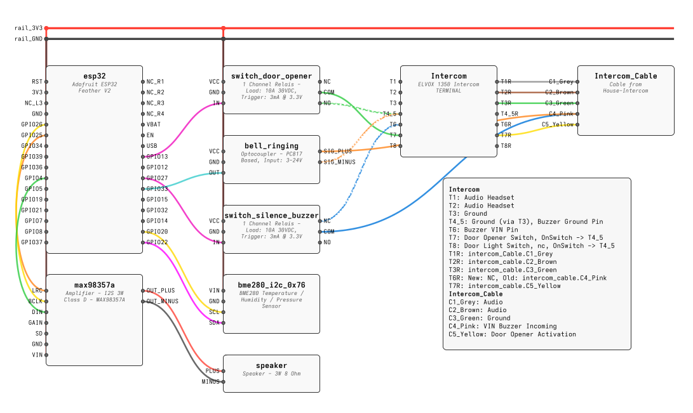
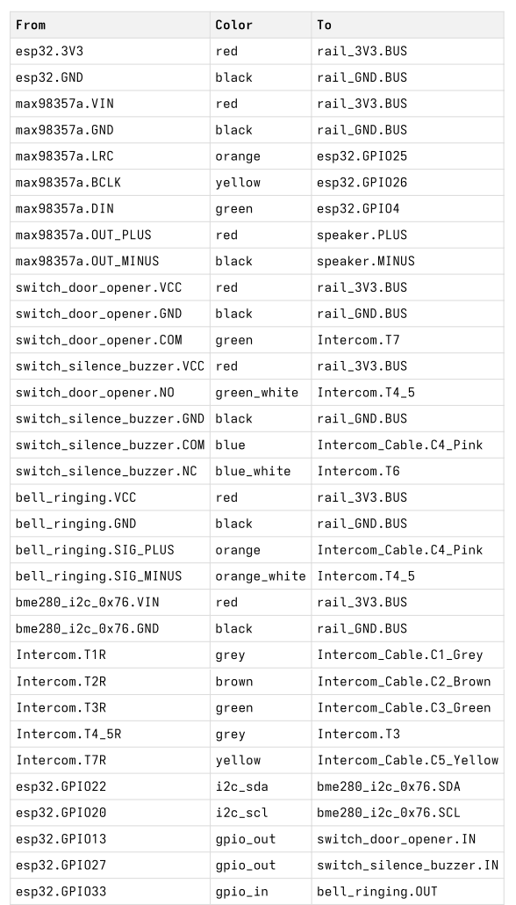
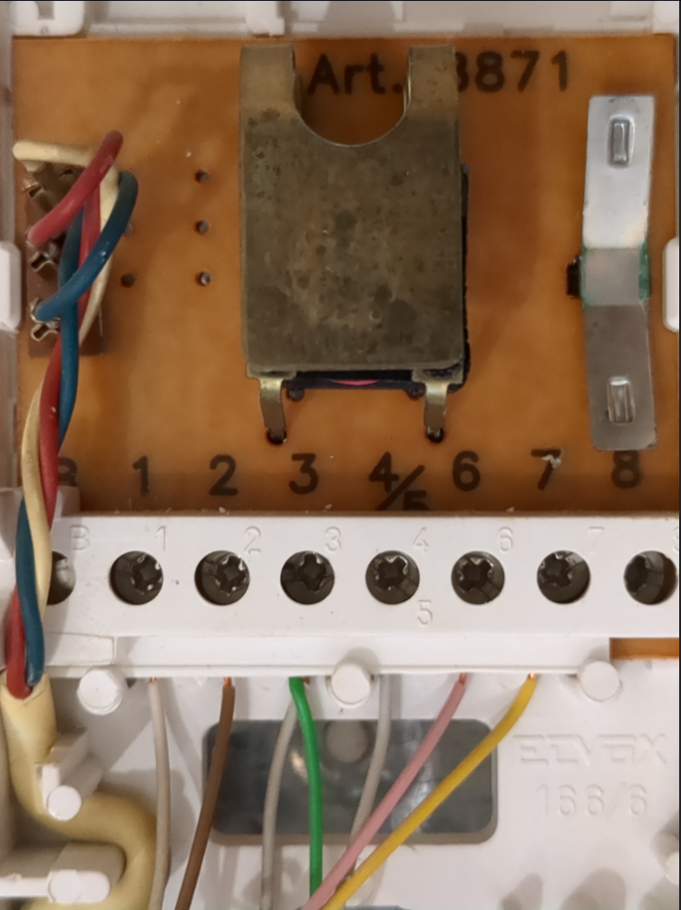
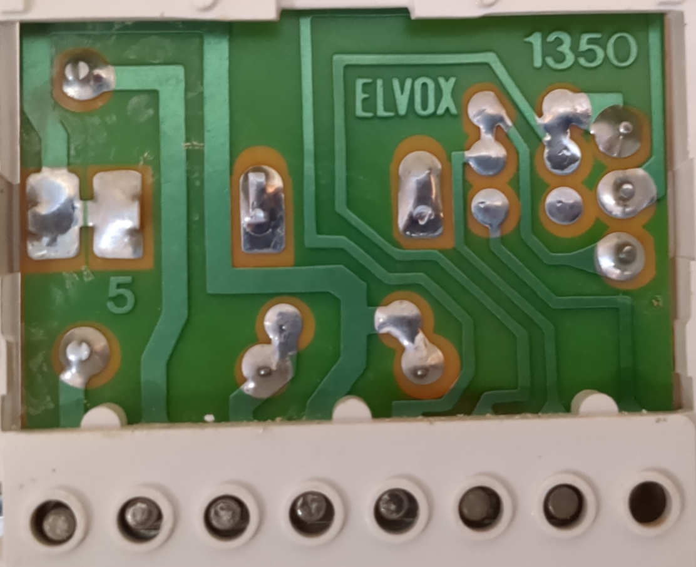
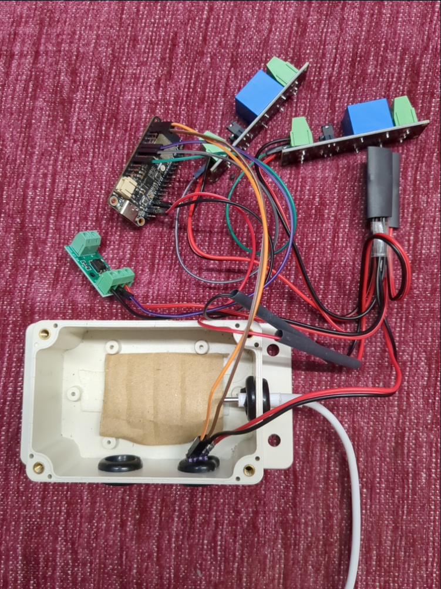
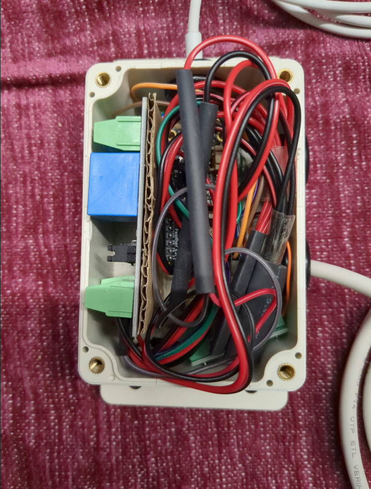

# ESPHome based Intercom Adapter

Upgrades an existing apartment intercom system with additional functionality. Was fun doing it. Might be useful to others.

## Features

* 🔔 **Ring Detection:** Detects when the intercom bell is ringing
* 🔕 **Buzzer Silence:** A switch to silence the intercom's physical buzzer
* 🚪 **Door Opener:** A switch to remotely activate the door opener
* 🌡️ **Environment Sensing:** An unrelated optional BME280 sensor provides local temperature, humidity, and pressure readings

### Missing Features

* 🎤 **Remote Microphone and Speaker:** Act as a remote microphone and speaker for Home Assistant.

Maybe another time.

### ⚠️ Safety Disclaimer

**Please be aware:**

*   While doing the research for this Intercom, I found that there are a wide variety of different Intercom systems out there.
*   Bear in mind, that even two installations in the same complex may use **different wire color codings**. The colors in the diagram are also specific to this specific installation.
*   This project requires the use of a **multimeter** (for identifying signals) and handling a **soldering iron**.
*   If you are not comfortable with these tools, please seek help for measuring and soldering from someone more experienced. Incorrect wiring **can damage** your intercom system or the components.

## Hardware Components

The firmware build is lightweight (approx. 960kB flash, 36kB RAM), so nearly any ESP32 development board should be sufficient. Prices are approximate.

| Qty | Component | Search Term | Approx. Price (EUR) |
| :--- | :--- | :--- | :--- |
| 1 | ESP32 Dev Board | ESP32 Feather V2 or ESP32 WROOM 32 Dev Kit | € 12.00 |
| 2 | 1-Channel Relay Module | 1 Channel Relay Module 3.3V | € 5.00 (for 2) |
| 1 | Optocoupler Module | PC817 Optocoupler Module | € 2.00 |
| 1 | Project Enclosure | Junction Box IP65 (small) | € 5.00 |
| | **Sum** | | **€ 24.00** |
| 1 | I2C Sensor | (optional) BME280 Sensor I2C | € 3.00 |
| 1 | Power Cable | USB-Cable | € 2.50 |
| 1 | Power Supply | `USB-Power Adapter` | € 5.00 |
| | **Total** | | **€ 34.50** |

## Wiring and Assembly

The core of the project is connecting the ESP32 to the intercom's terminals.
The ESP32 uses an optocoupler to safely detect the ring signal (voltage) and two relays to "press" the door open button and to silence the physical buzzer.

### Wiring Diagram

This diagram shows the connections between the ESP32, the peripheral modules, and the Intercom (an Elvox 1350).



Together with the List of all Connections as List:




There is a [wiring_diagram.pdf](assets/wiring_diagram.pdf) available. If printed double-sided (short edge), it creates a fitting inlay for a typical junction box, allowing anyone who accesses the box to easily understand the wiring.

## Intercom Model (Elvox 1350)

These photos show the specific intercom model (Art. 1350) and its terminal block. **Your terminals and wire colors will likely be different.** Use a multimeter to identify the correct pins for Ground, Bell/Buzzer signal, and Door Open activation on your own system.

### Front Side (Terminals)



### Back Side (PCB)



## Assembly

The components were wired according to the diagram and fitted into a small project enclosure.

| Unassembled Components | Final Assembly in Enclosure |
| :---: | :---: |
|  |  |

## Software and Integration

This project is designed to be used with [ESPHome](https://esphome.io/).

### Configuration

All software configuration is handled in the [intercom.yaml](intercom.yaml) file. Before building, you must provide your local credentials in the `substitutions` section at the top of the file. This includes:

*   `wifi_ssid`: Your Wi-Fi network name.
*   `wifi_password`: Your Wi--Fi password.
*   `mqtt_broker`: The address of your MQTT broker.
*   `mqtt_username`: Your MQTT username.
*   `mqtt_password`: Your MQTT password.
*   `ota_password`: A password for securing wireless updates.

### Build and Install

You can build and install the firmware using the ESPHome dashboard (a Home Assistant add-on) or the ESPHome command-line tool.

**Using the ESPHome Command-Line Tool**

1.  **Compile:** To validate the configuration and compile the firmware, run:
    ```bash
    esphome compile intercom.yaml
    ```
2.  **Upload:** To compile and upload the firmware to the device, run the following command. For the initial installation, connect the ESP32 to your computer via USB. For subsequent updates, this command will work wirelessly (OTA).
    ```bash
    esphome run intercom.yaml
    ```

**Using the ESPHome Dashboard (Home Assistant)**

1.  **Initial Install:** Connect the ESP32 board to your computer via USB. Use the ESPHome "Install" command and select the "USB" option to flash the initial firmware.
2.  **Wireless Updates (OTA):** Once the device is running and connected to your network, you can send all subsequent updates wirelessly. Simply use the "Install" command again, but select the wireless option.

### MQTT

The device connects to an MQTT broker and makes the following entities available:

* 🔔 **Binary Sensor:** Ring detection (On/Off) `bell_ringing`
* 🚪 **Switch:** Door opener trigger `switch_door_opener`
* 🔕 **Switch:** Buzzer silence toggle `switch_silence_buzzer`
* 🌡️ **Sensors (BME280):** Temperature, Humidity, Pressure (`air_temperature`, `air_pressure`, `air_moisture`)
* 📜 **Text Sensor:** Detects and displays Morse code patterns from the doorbell `detected_morse_code`

### Home Assistant

If you are running Home Assistant with the MQTT integration, the device and its entities should be discovered automatically once it connects to your MQTT broker.

### Wiring Diagram Regeneration

This project includes a vibecoded Python Notebook and Script, [create_intercom_wiring.ipynb](create_intercom_wiring.ipynb), that generates the detailed two page [wiring_diagram.pdf](assets/wiring_diagram.pdf) file.

The script parses the optional `substitutions:hardware` section within [intercom.yaml](intercom.yaml), which defines all components, modules and their connections, to create an representation of the wiring. To regenerate the diagram if you modified [intercom.yaml](intercom.yaml), run the Python Notebook.

## Bonus: Morse Code Detection

As a bonus feature, the ring detection binary sensor can be used within an automation (e.g., in Home Assistant) to detect specific ringing patterns, such as a "secret knock" via Morse code. The detected sequence is published to a dedicated text sensor.

## License

This project is licensed under a [**Creative Commons Attribution (CC BY)**](https://creativecommons.org/licenses/by/4.0/) license.

A @netdago in memoriam mini-project.

